# 🔗 External Database Integration Examples

**For:** Database Integration with Validated Residue Data
**Date:** October 17, 2025

---

## EXAMPLE 1: JSON Import Format

### Your External Database Format

```json
{
  "residues": [
    {
      "id": "RES_AGR_001",
      "name": "Bagaço de Cana",
      "category": "Agricultura",
      "sector_icon": "🌾",
      "generation": "280 kg MS/ton cana",
      "destination": "100% cogeração elétrica",

      "chemical_composition": {
        "bmp": {
          "value": 175.0,
          "unit": "L CH₄/kg VS",
          "min": 150.0,
          "mean": 175.0,
          "max": 200.0
        },
        "total_solids_ts": {
          "value": 50.0,
          "unit": "%"
        },
        "volatile_solids_vs": {
          "value": 85.0,
          "unit": "% of TS"
        },
        "moisture": {
          "value": 50.0,
          "unit": "%"
        },
        "cn_ratio": {
          "value": 65.0,
          "min": 50.0,
          "max": 80.0
        }
      },

      "availability_factors": {
        "collection_fc": {
          "value": 0.80,
          "min": 0.60,
          "max": 0.90,
          "notes": "Industrial process, centralized"
        },
        "competition_fcp": {
          "value": 1.0,
          "min": 0.85,
          "max": 1.0,
          "notes": "100% used in cogeração - NO AVAILABLE"
        },
        "seasonal_fs": {
          "value": 1.0,
          "min": 0.80,
          "max": 1.0,
          "notes": "Year-round availability"
        },
        "logistic_fl": {
          "value": 0.70,
          "min": 0.60,
          "max": 0.90,
          "notes": "30-50 km radius from usina"
        }
      },

      "operational_parameters": {
        "hrt_days": {
          "value": "25 dias",
          "min": 20.0,
          "max": 30.0
        },
        "temperature_celsius": {
          "value": "35-37°C",
          "type": "mesofílica"
        },
        "reactor_type": "CSTR ou UASB",
        "notes": "Pré-hidrólise recomendada"
      },

      "scenarios": {
        "pessimista": 0.0,
        "realista": 0.0,
        "otimista": 0.0,
        "teorico_100": 12270.0
      },

      "references": [
        {
          "title": "Bagasse characteristics and methane potential",
          "authors": "Author, A.; Author, B.",
          "year": 2020,
          "doi": "10.1016/xxxx",
          "journal": "Bioenergy Journal",
          "relevance": "High",
          "key_findings": [
            "BMP: 175 L CH₄/kg VS",
            "TS: 50%, VS: 85% of TS"
          ]
        }
      ],

      "data_quality": {
        "completeness_pct": 96.0,
        "validation_status": "PASS",
        "last_updated": "2025-10-17"
      }
    }
  ]
}
```

### Mapping to ResidueData

```python
from src.utils.external_db_adapter import adapt_external_residue
from src.models.residue_models import (
    ResidueData, ChemicalParameters, AvailabilityFactors,
    OperationalParameters, ScientificReference, ParameterRange
)

# Your JSON data
external_residue = {
    "name": "Bagaço de Cana",
    "category": "Agricultura",
    # ... rest of external data
}

# Conversion function
def adapt_external_residue(ext: Dict) → ResidueData:

    # Extract chemical parameters
    chem = ext["chemical_composition"]
    chemical_params = ChemicalParameters(
        bmp=chem["bmp"]["value"],
        bmp_unit=chem["bmp"]["unit"],
        ts=chem["total_solids_ts"]["value"],
        vs=chem["volatile_solids_vs"]["value"],
        vs_basis=chem["volatile_solids_vs"]["unit"],
        moisture=chem["moisture"]["value"],

        # Optional ranges
        bmp_range=ParameterRange(
            min=chem["bmp"]["min"],
            mean=chem["bmp"]["mean"],
            max=chem["bmp"]["max"],
            unit=chem["bmp"]["unit"]
        ),
        cn_ratio=chem.get("cn_ratio", {}).get("value"),
        cn_ratio_range=ParameterRange(
            min=chem.get("cn_ratio", {}).get("min"),
            mean=chem.get("cn_ratio", {}).get("value"),
            max=chem.get("cn_ratio", {}).get("max")
        ) if chem.get("cn_ratio") else None,
    )

    # Extract availability factors
    avail = ext["availability_factors"]
    availability = AvailabilityFactors(
        fc=avail["collection_fc"]["value"],
        fcp=avail["competition_fcp"]["value"],
        fs=avail["seasonal_fs"]["value"],
        fl=avail["logistic_fl"]["value"],
        final_availability=calculate_availability(
            avail["collection_fc"]["value"],
            avail["competition_fcp"]["value"],
            avail["seasonal_fs"]["value"],
            avail["logistic_fl"]["value"]
        ),
        fc_range=ParameterRange(
            min=avail["collection_fc"].get("min"),
            mean=avail["collection_fc"]["value"],
            max=avail["collection_fc"].get("max")
        ),
        # ... similar for fcp, fs, fl
    )

    # Extract operational parameters
    ops = ext["operational_parameters"]
    operational = OperationalParameters(
        hrt=ops["hrt_days"]["value"],
        temperature=ops["temperature_celsius"]["value"],
        reactor_type=ops.get("reactor_type"),
        hrt_range=ParameterRange(
            min=ops["hrt_days"].get("min"),
            mean=float(ops["hrt_days"]["value"].split()[0]),
            max=ops["hrt_days"].get("max"),
            unit="days"
        ),
    )

    # Extract references
    references = [
        ScientificReference(
            title=ref["title"],
            authors=ref["authors"],
            year=ref["year"],
            doi=ref.get("doi"),
            journal=ref.get("journal"),
            relevance=ref.get("relevance", "High"),
            key_findings=ref.get("key_findings", [])
        )
        for ref in ext.get("references", [])
    ]

    # Create ResidueData object
    return ResidueData(
        name=ext["name"],
        category=ext["category"],
        icon=ext["sector_icon"],
        generation=ext["generation"],
        destination=ext["destination"],
        chemical_params=chemical_params,
        availability=availability,
        operational=operational,
        justification=ext.get("justification", ""),
        scenarios=ext.get("scenarios", {}),
        references=references
    )

# Use it
residue_data = adapt_external_residue(external_residue)
```

---

## EXAMPLE 2: CSV Import Format

### Your CSV File Format

```csv
residue_name,category,bmp,bmp_unit,ts,vs,moisture,cn_ratio,ph,
fc_min,fc_mean,fc_max,fcp_min,fcp_mean,fcp_max,fs_min,fs_mean,fs_max,fl_min,fl_mean,fl_max,
final_availability,hrt_days,temperature_celsius,pessimista_ch4,realista_ch4,otimista_ch4,teorico_ch4,
generation,destination,justification,reference_title,reference_authors,reference_year,reference_doi,data_quality_pct

Bagaço de Cana,Agricultura,175.0,L CH₄/kg VS,50.0,85.0,50.0,65.0,NULL,
0.60,0.80,0.90,0.85,1.0,1.0,0.80,1.0,1.0,0.60,0.70,0.90,
0.0,25,35-37°C,0.0,0.0,0.0,12270.0,
280 kg MS/ton cana,100% cogeração,"Bagaço completamente comprometido",
"Bagasse methane potential",Moeller; Smith; Jones,2020,10.1016/xxxx,96.0

Palha de Cana,Agricultura,300.0,L CH₄/kg VS,88.5,90.5,11.5,100.0,NULL,
0.60,0.80,0.80,0.40,0.65,0.65,0.70,0.85,1.0,0.80,0.90,0.90,
36.00,50,35-55°C,1800.0,2250.0,3200.0,6250.0,
280 kg MS/ton cana,40% cobertura + 60% disponível,"Palha com 36% disponível",
"Sugarcane straw removal effects",Satiro; et al.,2017,10.1016/geodrs,92.0
```

### CSV to ResidueData Conversion

```python
import csv
from src.utils.external_db_adapter import adapt_csv_row

def import_csv_residues(csv_file_path: str) → Dict[str, ResidueData]:
    """Import residues from CSV file"""

    residues = {}

    with open(csv_file_path, 'r', encoding='utf-8') as f:
        reader = csv.DictReader(f)

        for row in reader:
            try:
                # Convert CSV row to ResidueData
                residue = adapt_csv_row(row)

                # Validate
                is_valid, errors = residue.validate()
                if not is_valid:
                    print(f"Validation errors in {residue.name}: {errors}")
                    continue

                # Store
                residues[residue.name] = residue
                print(f"✅ Imported: {residue.name}")

            except Exception as e:
                print(f"❌ Error importing row {row.get('residue_name')}: {e}")

    return residues

def adapt_csv_row(row: Dict[str, str]) → ResidueData:
    """Convert CSV row to ResidueData object"""

    from src.services.availability_calculator import AvailabilityCalculator

    # Parse numeric values
    fc_mean = float(row['fc_mean'])
    fcp_mean = float(row['fcp_mean'])
    fs_mean = float(row['fs_mean'])
    fl_mean = float(row['fl_mean'])

    # Calculate availability if not provided
    if row.get('final_availability'):
        final_availability = float(row['final_availability'])
    else:
        final_availability = AvailabilityCalculator.calculate(
            fc_mean, fcp_mean, fs_mean, fl_mean
        )

    # Build ResidueData
    return ResidueData(
        name=row['residue_name'],
        category=row['category'],
        icon='🌾' if row['category'] == 'Agricultura' else '🐄',  # etc.
        generation=row['generation'],
        destination=row['destination'],

        chemical_params=ChemicalParameters(
            bmp=float(row['bmp']),
            bmp_unit=row['bmp_unit'],
            ts=float(row['ts']),
            vs=float(row['vs']),
            vs_basis='% of TS',
            moisture=float(row['moisture']),
            cn_ratio=float(row['cn_ratio']) if row['cn_ratio'] != 'NULL' else None,
            ph=float(row['ph']) if row['ph'] != 'NULL' else None,

            bmp_range=ParameterRange(
                min=float(row['bmp']),
                mean=float(row['bmp']),
                max=float(row['bmp']),
                unit=row['bmp_unit']
            ),
        ),

        availability=AvailabilityFactors(
            fc=fc_mean,
            fcp=fcp_mean,
            fs=fs_mean,
            fl=fl_mean,
            final_availability=final_availability,

            fc_range=ParameterRange(
                min=float(row['fc_min']),
                mean=float(row['fc_mean']),
                max=float(row['fc_max'])
            ),
            fcp_range=ParameterRange(
                min=float(row['fcp_min']),
                mean=float(row['fcp_mean']),
                max=float(row['fcp_max'])
            ),
            fs_range=ParameterRange(
                min=float(row['fs_min']),
                mean=float(row['fs_mean']),
                max=float(row['fs_max'])
            ),
            fl_range=ParameterRange(
                min=float(row['fl_min']),
                mean=float(row['fl_mean']),
                max=float(row['fl_max'])
            ),
        ),

        operational=OperationalParameters(
            hrt=f"{row['hrt_days']} days",
            temperature=row['temperature_celsius'],
        ),

        justification=row.get('justification', ''),

        scenarios={
            'Pessimista': float(row['pessimista_ch4']),
            'Realista': float(row['realista_ch4']),
            'Otimista': float(row['otimista_ch4']),
            'Teórico (100%)': float(row['teorico_ch4']),
        },

        references=[
            ScientificReference(
                title=row['reference_title'],
                authors=row['reference_authors'],
                year=int(row['reference_year']),
                doi=row.get('reference_doi'),
            )
        ] if row.get('reference_title') else [],
    )

# Usage
residues = import_csv_residues('external_residues.csv')
print(f"Imported {len(residues)} residues successfully")
```

---

## EXAMPLE 3: Integrate Into Registry

### Update the Central Registry

```python
# In: src/data/residue_registry.py

from src.utils.external_db_adapter import import_csv_residues, adapt_external_residue
import json

def integrate_external_database(
    source_type: str = 'csv',  # 'csv' or 'json'
    source_path: str = None,
    source_data: Dict = None
) → Dict[str, str]:  # {residue_name: status}
    """
    Integrate external validated residue database

    Args:
        source_type: 'csv', 'json', or 'api'
        source_path: Path to file (for csv/json)
        source_data: Direct data dict (for json)

    Returns:
        Summary of integration results
    """

    results = {}
    new_residues = {}
    updated_residues = {}
    skipped_residues = {}

    try:
        # 1. Import based on source type
        if source_type == 'csv':
            residues_to_add = import_csv_residues(source_path)
        elif source_type == 'json':
            if source_data:
                residues_to_add = {
                    r['name']: adapt_external_residue(r)
                    for r in source_data.get('residues', [])
                }
            else:
                with open(source_path, 'r', encoding='utf-8') as f:
                    data = json.load(f)
                    residues_to_add = {
                        r['name']: adapt_external_residue(r)
                        for r in data.get('residues', [])
                    }
        else:
            raise ValueError(f"Unsupported source_type: {source_type}")

        # 2. Process each residue
        for residue_name, residue_data in residues_to_add.items():

            # Validate
            is_valid, errors = residue_data.validate()

            if not is_valid:
                skipped_residues[residue_name] = f"Validation errors: {errors}"
                continue

            # Check for existing
            if residue_name in RESIDUES_REGISTRY:
                # Merge strategy: New data takes precedence if better quality
                existing = RESIDUES_REGISTRY[residue_name]

                new_completeness = residue_data.check_completeness()
                existing_completeness = existing.check_completeness()

                if new_completeness['completeness_percentage'] > \
                   existing_completeness['completeness_percentage']:

                    # Update
                    RESIDUES_REGISTRY[residue_name] = residue_data
                    updated_residues[residue_name] = "Updated with higher quality data"
                    results[residue_name] = "UPDATED"
                else:
                    # Keep existing
                    skipped_residues[residue_name] = \
                        "Existing data has higher quality"
                    results[residue_name] = "SKIPPED"
            else:
                # New residue
                RESIDUES_REGISTRY[residue_name] = residue_data
                new_residues[residue_name] = residue_data
                results[residue_name] = "ADDED"

        # 3. Rebuild sector registries
        _rebuild_sector_registries()

        # 4. Generate report
        report = {
            'total_processed': len(residues_to_add),
            'new_residues': len(new_residues),
            'updated_residues': len(updated_residues),
            'skipped_residues': len(skipped_residues),
            'new': list(new_residues.keys()),
            'updated': list(updated_residues.keys()),
            'skipped': skipped_residues,
            'results': results,
        }

        print("\n" + "="*60)
        print("DATABASE INTEGRATION REPORT")
        print("="*60)
        print(f"✅ New residues added: {len(new_residues)}")
        print(f"🔄 Updated residues: {len(updated_residues)}")
        print(f"⏭️ Skipped residues: {len(skipped_residues)}")
        print(f"📊 Total registry size: {len(RESIDUES_REGISTRY)}")
        print("="*60 + "\n")

        return report

    except Exception as e:
        print(f"❌ Integration failed: {e}")
        raise

def _rebuild_sector_registries():
    """Rebuild sector registries after import"""

    # Rebuild each sector
    from src.data import agricultura, pecuaria, urbano, industrial

    # Clear and rebuild
    agricultura.AGRICULTURA_RESIDUES.clear()
    pecuaria.PECUARIA_RESIDUES.clear()
    urbano.URBANO_RESIDUES.clear()
    industrial.INDUSTRIAL_RESIDUES.clear()

    # Repopulate by category
    for residue_name, residue_data in RESIDUES_REGISTRY.items():
        if residue_data.category == 'Agricultura':
            agricultura.AGRICULTURA_RESIDUES[residue_name] = residue_data
        elif residue_data.category == 'Pecuária':
            pecuaria.PECUARIA_RESIDUES[residue_name] = residue_data
        elif residue_data.category == 'Urbano':
            urbano.URBANO_RESIDUES[residue_name] = residue_data
        elif residue_data.category == 'Industrial':
            industrial.INDUSTRIAL_RESIDUES[residue_name] = residue_data
```

---

## EXAMPLE 4: Validation After Import

### Quality Assurance

```python
def validate_integration(verbose: bool = True) → Dict:
    """
    Comprehensive validation after integration

    Returns:
        Validation report with issues
    """

    report = {
        'total_residues': len(RESIDUES_REGISTRY),
        'valid_residues': 0,
        'invalid_residues': [],
        'quality_distribution': {},
        'data_gaps': [],
        'warnings': []
    }

    # Check each residue
    for residue_name, residue_data in RESIDUES_REGISTRY.items():

        # 1. Basic validation
        is_valid, errors = residue_data.validate()

        if is_valid:
            report['valid_residues'] += 1
        else:
            report['invalid_residues'].append({
                'name': residue_name,
                'errors': errors
            })
            continue

        # 2. Quality check
        completeness = residue_data.check_completeness()
        quality_pct = completeness['completeness_percentage']

        quality_band = 'Excellent' if quality_pct >= 90 else \
                       'Good' if quality_pct >= 80 else \
                       'Acceptable' if quality_pct >= 60 else 'Poor'

        if quality_band not in report['quality_distribution']:
            report['quality_distribution'][quality_band] = 0
        report['quality_distribution'][quality_band] += 1

        # 3. Data gap detection
        if not residue_data.references or len(residue_data.references) < 2:
            report['warnings'].append(
                f"{residue_name}: Insufficient references ({len(residue_data.references)})"
            )

        if residue_data.chemical_params.ph is None:
            report['data_gaps'].append(f"{residue_name}: Missing pH value")

        if residue_data.chemical_params.cod is None:
            report['data_gaps'].append(f"{residue_name}: Missing COD value")

    # Print report
    if verbose:
        print("\nVALIDATION REPORT")
        print("-" * 60)
        print(f"✅ Valid residues: {report['valid_residues']}")
        print(f"❌ Invalid residues: {len(report['invalid_residues'])}")
        print(f"\nQuality Distribution:")
        for quality_band, count in report['quality_distribution'].items():
            print(f"  {quality_band}: {count}")
        print(f"\n⚠️ Warnings: {len(report['warnings'])}")
        for warning in report['warnings'][:5]:
            print(f"  - {warning}")
        print(f"\n📍 Data gaps: {len(report['data_gaps'])}")
        for gap in report['data_gaps'][:5]:
            print(f"  - {gap}")
        print("-" * 60 + "\n")

    return report

# Usage
report = validate_integration(verbose=True)

if report['invalid_residues']:
    print("Please fix the following residues:")
    for invalid in report['invalid_residues']:
        print(f"  - {invalid['name']}: {invalid['errors']}")
```

---

## EXAMPLE 5: Update UI After Integration

### Verify UI Works

```python
def test_ui_with_new_data():
    """Test that UI components work with newly imported data"""

    from src.ui import render_availability_card, render_scenario_selector
    from src.services import ScenarioManager

    # Get a new residue from registry
    residues = list(RESIDUES_REGISTRY.values())

    if not residues:
        print("No residues in registry!")
        return

    test_residue = residues[0]

    print(f"Testing UI with: {test_residue.name}")
    print(f"  Category: {test_residue.category}")
    print(f"  Availability: {test_residue.availability.final_availability}%")

    # Test services
    try:
        scenarios = ScenarioManager.compare_scenarios(test_residue)
        print(f"  ✅ ScenarioManager working")

        for scenario, data in scenarios.items():
            print(f"    - {scenario}: {data['availability']:.1f}%")
    except Exception as e:
        print(f"  ❌ ScenarioManager error: {e}")

    # Test validation
    try:
        is_valid, errors = test_residue.validate()
        print(f"  ✅ Validation: {'PASS' if is_valid else 'FAIL'}")

        if errors:
            for error in errors:
                print(f"    - {error}")
    except Exception as e:
        print(f"  ❌ Validation error: {e}")

test_ui_with_new_data()
```

---

## Integration Workflow

```mermaid
graph TD
    A["Your Validated Database"] -->|CSV or JSON| B["External Adapter"]
    B -->|Validate Format| C["Conversion Layer"]
    C -->|Map to ResidueData| D["Quality Check"]
    D -->|Validate Data| E{"Quality OK?"}
    E -->|Yes| F["Merge with Registry"]
    E -->|No| G["Log Errors"]
    F -->|Rebuild Sectors| H["Update UI"]
    H -->|Test All Components| I["Integration Complete ✅"]
    G -->|Report Issues| J["Fix Data"]
    J -->|Re-import| B
```



---

**Ready to integrate your validated residue database!** 🚀
